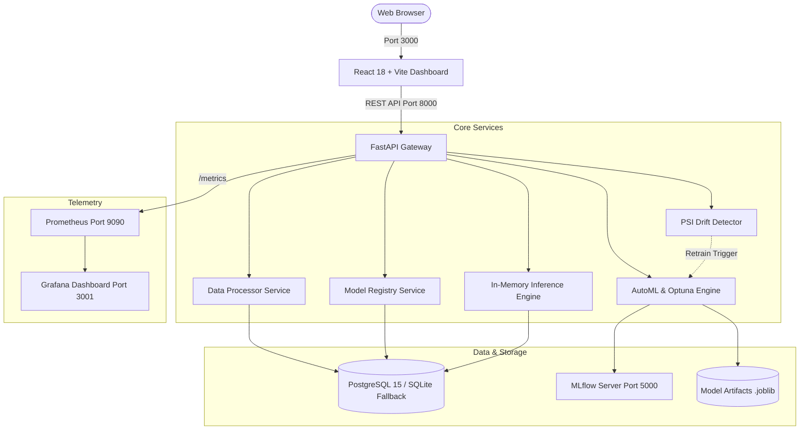

# Cloud-Based MLOps Platform

[](https://fastapi.tiangolo.com)
[](https://react.dev)
[](https://scikit-learn.org)
[](https://optuna.org)
[](https://mlflow.org)
[](https://prometheus.io)
[](https://grafana.com)
[](https://docker.com)
[](https://kubernetes.io)

**GitHub Repository:** [https://github.com/aditya060414/Cloud_project](https://github.com/aditya060414/Cloud_project)

---

## 1. Project Overview

The **Cloud-Based MLOps Platform** is an enterprise-grade Machine Learning Operations (MLOps) architecture designed for academic capstones, viva reviews, and production demonstrations. 

It provides an interactive, full-stack demonstration of the complete machine learning lifecycle with **zero paid cloud bills** (no AWS, GCP, or Azure costs required). Everything runs on your local machine using Docker Compose or directly on native host environments with automatic SQLite fallback.

```
Dataset Ingestion ──► Automated Cleaning ──► AutoML Tuning (Optuna) ──► Model Leaderboard
                                                                                │
                                                                                ▼
Automated Retrain ◄── Data Drift Alert ◄── Real-Time Metrics ◄── REST Inference ◄── Model Registry
```

---

## 2. Architecture & Design



```
                                 [ Web Browser ]
                                        │
                         HTTP / JSON    ▼    Port 3000
                    ┌────────────────────────────────────────┐
                    │      React 18 + Vite Dashboard        │
                    │   (Tailwind CSS + Recharts + Lucide)   │
                    └───────────────────┬────────────────────┘
                                        │ REST API Requests
                                        ▼ Port 8000
    ┌────────────────────────────────────────────────────────────────────────┐
    │                       FastAPI Application Gateway                      │
    │  ┌──────────────────┬──────────────────┬────────────────────────────┐  │
    │  │ /datasets        │ /training        │ /models & /predict         │  │
    │  │ Data Processing  │ AutoML Engine    │ In-Memory Inference Runtime│  │
    │  │ Median Imputer   │ Optuna Tuner     │ Model Registry Governance  │  │
    │  │ IQR Outlier Clip │ 5 ML Algorithms  │ Latency & Drift Tracker    │  │
    │  └────────┬─────────┴────────┬─────────┴─────────────┬──────────────┘  │
    └───────────┼──────────────────┼───────────────────────┼─────────────────┘
                │                  │                       │
                ▼                  ▼                       ▼
    ┌──────────────────────┐ ┌───────────┐ ┌─────────────────────────────────┐
    │ PostgreSQL / SQLite  │ │ MLflow    │ │ Prometheus Exporter (/metrics)  │
    │ • Dataset Metadata   │ │ Port 5000 │ │ • prediction_requests_total     │
    │ • Training Jobs      │ │ • Runs    │ │ • prediction_latency_seconds    │
    │ • Model Registry     │ │ • Metrics │ │ • drift_score (PSI)             │
    │ • Prediction Logs    │ │ • Artifact│ │ • drift_alerts_total            │
    │ • Drift Reports      │ └───────────┘ └────────────────┬────────────────┘
    └──────────────────────┘                                │ Scrapes Port 8000
                                                            ▼ Port 9090
                                                   ┌─────────────────┐
                                                   │   Prometheus    │
                                                   └────────┬────────┘
                                                            │ Datasource
                                                            ▼ Port 3001
                                                   ┌─────────────────┐
                                                   │     Grafana     │
                                                   │ Real-Time Dash  │
                                                   └─────────────────┘
```

---

## 3. Key Features

- **Automated Data Profiling**: CSV inspection, data type detection, duplicate identification, and null value profiling.
- **Smart Data Cleaning**: Imputes missing continuous features with column **median**, categorical features with **mode**, clips **IQR outliers**, and saves fitted preprocessing pipelines (`.joblib`).
- **Autonomous Machine Learning (AutoML)**: Evaluates 5 candidate classifiers:
  1. *Random Forest Classifier*
  2. *Gradient Boosting Classifier*
  3. *Logistic Regression*
  4. *Support Vector Machine (SVM)*
  5. *K-Nearest Neighbors (KNN)*
- **Optuna Hyperparameter Tuning**: Bayesian optimization per algorithm to maximize chosen metric ($\text{F}_1$-Score, Accuracy, Precision, Recall).
- **Comparative Model Leaderboard**: Multi-model performance comparison bar charts, automatic champion model selection, and hyperparameter inspection.
- **Model Registry & Governance**: Semantic versioning (`v1`, `v2`, ...), environment stages (`STAGING`, `PRODUCTION`, `ARCHIVED`), instant zero-downtime rollbacks, and `.joblib` model artifact downloads.
- **Low-Latency In-Memory Inference**: Production model is pre-warmed in memory for sub-5ms predictions via `POST /predict`.
- **Real Population Stability Index (PSI) Drift Detection**:
  $$\text{PSI} = \sum_{b=1}^{B} \left( \text{Actual}_b\% - \text{Expected}_b\% \right) \times \ln\left( \frac{\text{Actual}_b\%}{\text{Expected}_b\%} \right)$$
  - $\text{PSI} < 0.10$: **Normal / Stable**
  - $0.10 \le \text{PSI} \le 0.25$: **Warning / Moderate Shift**
  - $\text{PSI} > 0.25$: **Critical Data Drift Detected**
- **1-Click Live Drift Simulator**: Perturbs incoming traffic distributions in real-time to trigger drift alerts.
- **Automated Retraining Loop**: Retrains on shifted data distributions, versions the model to `v2`, and promotes it with zero downtime.
- **Full Observability**: Prometheus scraping with Grafana dashboards provisioned out-of-the-box.
- **Kubernetes Production Manifests**: Includes Horizontal Pod Autoscaler (`HPA`) scaling between 2 and 10 pods on CPU/Memory thresholds.

---

## 4. Web Application URLs

| Service | Local URL | Default Credentials | Purpose |
|---|---|---|---|
| **React Dashboard** | [http://localhost:3000](http://localhost:3000) | None | Complete MLOps user interface |
| **FastAPI Backend** | [http://localhost:8000](http://localhost:8000) | None | REST API Gateway & Inference runtime |
| **Swagger / OpenAPI** | [http://localhost:8000/docs](http://localhost:8000/docs) | None | Interactive API explorer |
| **MLflow UI** | [http://localhost:5000](http://localhost:5000) | None | Experiment runs & model registry |
| **Grafana Dashboard** | [http://localhost:3001](http://localhost:3001) | `admin` / `admin` | Real-time observability charts |
| **Prometheus Metrics** | [http://localhost:9090](http://localhost:9090) | None | Time-series scraper & alerts |

---

## 5. Prerequisites

- **Option A (Docker)**: Docker Desktop running on your machine.
- **Option B (Native Run)**:
  - Python 3.10+ (Python 3.11 or 3.13 recommended)
  - Node.js 18+ (Node 20 or 22 recommended) and npm

---

## 6. How to Run: Option 1 — Docker Compose (Full Stack)

This launches all 6 microservices (Frontend, Backend, PostgreSQL, MLflow, Prometheus, Grafana) with health checks:

1. **Clone the repository**:
   ```bash
   git clone https://github.com/aditya060414/Cloud_project.git
   cd Cloud_project
   ```

2. **Create the environment file**:
   ```bash
   # Windows PowerShell:
   Copy-Item .env.example .env

   # Linux / macOS:
   cp .env.example .env
   ```

3. **Build and launch containers**:
   ```bash
   docker compose up --build
   ```
   *(To run in the background, append `-d`: `docker compose up --build -d`)*

4. Open **[http://localhost:3000](http://localhost:3000)** in your browser!

---

## 7. How to Run: Option 2 — Native Local Run (Without Docker)

You can run the backend and frontend directly on your computer without starting Docker Desktop. The backend automatically detects that PostgreSQL is offline and transparently uses local SQLite `backend/mlops.db`.

### Terminal 1: Start Backend (FastAPI)

```powershell
# Navigate to backend directory
cd c:\ML\cloud_project\backend

# Create and activate Python virtual environment
py -3.13 -m venv --system-site-packages .venv
.\.venv\Scripts\Activate.ps1

# Install requirements (if not already installed)
pip install -r requirements.txt

# Start FastAPI server
python -m uvicorn app.main:app --host 0.0.0.0 --port 8000 --reload
```
> The API will be live at [http://localhost:8000](http://localhost:8000) and Swagger docs at [http://localhost:8000/docs](http://localhost:8000/docs).

### Terminal 2: Start Frontend (React + Vite)

```powershell
# Navigate to frontend directory
cd c:\ML\cloud_project\frontend

# Install dependencies
npm install

# Start Vite development server
npm run dev
```
> The dashboard will be live at [http://localhost:3000](http://localhost:3000). Vite automatically proxies API requests (`/api`, `/predict`, `/health`, `/metrics`) to port 8000.

---

## 8. Important: Target Column Selection (Classification vs. Regression)

The platform's AutoML algorithms are **Classifiers** (Random Forest, Gradient Boosting, Logistic Regression, SVM, KNN). 

When uploading custom CSV datasets:
- **Recommended**: Select a **categorical or discrete column** as the target:
  - *Customer Churn dataset*: `churn` (0 or 1) $\rightarrow$ **Trains in 2.8s** with >70% accuracy!
  - *Iris dataset*: `species` (3 classes: Setosa, Versicolor, Virginica)
  - *Cars dataset*: `fuel` (4 classes: Diesel, Petrol, CNG, LPG) or `owner` (5 classes)
- **Avoid continuous numerical prices/quantities**: If you pick a continuous column like `selling_price` (which has 677 unique price values), classifiers will attempt to compute 677 separate classes, resulting in very long training times and low accuracy.

---

## 9. Complete Step-by-Step Viva Demo Workflow

Follow these 14 steps during a viva, project presentation, or demonstration:

1. **Upload Dataset**: Navigate to **Dataset Upload**. Click **"Load Customer Churn (1000 rows)"** for 1-click loading, or upload your own CSV.
2. **Select Target Column**: Verify the target column is set to `churn` (or another categorical column).
3. **Analyze Dataset**: Review total rows (1,004), column count (9), missing records (13), and duplicate rows (4).
4. **Clean Dataset**: Navigate to **Data Processing**. Review the automated cleaning operations (Median Imputation, Mode Imputation, Duplicate Removal, IQR Outlier Clipping). Click **"Run Data Processing"** to show before-and-after results:
   - Rows: `1,004` $\rightarrow$ `1,000`
   - Missing: `13` $\rightarrow$ `0`
   - Duplicates: `4` $\rightarrow$ `0`
5. **Start AutoML Training**: Navigate to **AutoML Training**. Select optimization metric (`F1 Score`), keep candidate algorithms selected, and click **"Start AutoML Training"**. Watch real-time Optuna hyperparameter optimization steps in the console.
6. **Model Leaderboard**: Navigate to **Model Leaderboard**. Inspect the comparative metrics bar chart (Accuracy, F1, Precision, Recall).
7. **Best Model Selection**: Review the auto-selected **Champion Model** with optimal hyperparameters tuned by Optuna.
8. **Model Registry**: Navigate to **Model Registry**. View version `v1` tagged with status `PRODUCTION`.
9. **Explain Model Governance**: Explain lifecycle stages (`STAGING`, `PRODUCTION`, `ARCHIVED`), 1-click promotion, and instant zero-downtime rollback.
10. **Live Prediction Playground**: Navigate to **Prediction Playground**:
    - Click **"Preset: Normal Customer"** $\rightarrow$ Click **"Try Prediction"** $\rightarrow$ Returns class `0` (Retained) with ~90% confidence and sub-5ms latency.
    - Click **"Preset: High-Risk Churn"** $\rightarrow$ Click **"Try Prediction"** $\rightarrow$ Returns class `1` (Churn) with sub-5ms latency.
11. **View Monitoring**: Navigate to **Monitoring & Metrics**. Review prediction request throughput, average latency distributions, and Prometheus audit trail.
12. **Simulate Data Drift**: Navigate to **Drift Detection**. Status initially shows **✓ No Drift Detected (PSI < 0.10)**. Click **"⚡ Simulate Data Drift (Demo)"**!
13. **Data Drift Alert**: The system shifts feature distributions, and the UI immediately turns red: **🚨 CRITICAL DATA DRIFT DETECTED IN PRODUCTION (PSI > 0.25)** with feature distribution comparison charts.
14. **Automated Retraining Loop**: An alert banner displays: *"Model retraining recommended."* Click **"Start Retraining Pipeline"**. AutoML retrains on the new distribution, registers model `v2`, updates the production runtime, and restores system health!

---

## 10. API Endpoints Reference

| Method | Endpoint | Description |
|---|---|---|
| `GET` | `/health` | Health check probe for Docker and Kubernetes |
| `GET` | `/metrics` | Prometheus metrics scrape format |
| `POST` | `/api/datasets/upload` | Upload and profile CSV dataset |
| `GET` | `/api/datasets` | List all registered datasets |
| `POST` | `/api/datasets/{id}/process` | Clean and prepare dataset (IQR, median, mode) |
| `POST` | `/api/datasets/load-sample/{name}` | Load sample dataset (`churn`, `iris`) |
| `POST` | `/api/training/start` | Launch AutoML hyperparameter study |
| `GET` | `/api/training` | List AutoML training jobs and leaderboards |
| `POST` | `/api/training/retrain` | Automated retraining trigger on drift alert |
| `GET` | `/api/models` | List all versioned models in registry |
| `GET` | `/api/models/active` | Get active PRODUCTION model schema |
| `POST` | `/api/models/{id}/promote` | Promote model version to Production |
| `POST` | `/api/models/{id}/rollback` | Rollback production to previous model |
| `POST` | `/predict` | Low-latency in-memory inference endpoint |
| `GET` | `/api/monitoring` | Get observability statistics and history |
| `GET` | `/api/monitoring/drift` | Get current PSI drift report |
| `POST` | `/api/monitoring/simulate-drift` | Synthesize feature distribution shift |

---

## 11. Kubernetes Deployment & Autoscaling

To demonstrate cloud-native scalability to your examiners:

1. Apply deployments and services:
   ```bash
   kubectl apply -f k8s/backend-deployment.yaml
   kubectl apply -f k8s/backend-service.yaml
   kubectl apply -f k8s/frontend-deployment.yaml
   kubectl apply -f k8s/frontend-service.yaml
   ```

2. Enable Horizontal Pod Autoscaling (HPA):
   ```bash
   kubectl apply -f k8s/hpa.yaml
   ```

3. Inspect pods and autoscaler:
   ```bash
   kubectl get pods -l tier=api
   kubectl get hpa mlops-backend-hpa
   ```
   *The HPA automatically scales backend replicas between 2 and 10 based on CPU (70%) and Memory (80%) utilization.*

---

## 12. Troubleshooting Guide

1. **`WinError 10054` / Pip Connection Closed**:
   - Occurs when PyPI connection drops during large package downloads.
   - Fix: Use `--system-site-packages` when creating `.venv` to reuse pre-installed wheels, or install with extended timeout:
     ```powershell
     pip install --default-timeout=100 --retries 5 -r requirements.txt
     ```

2. **AutoML Training Times Out in Browser**:
   - Occurs if you select a continuous numerical target (like `selling_price` with 600+ classes).
   - Fix: Select a categorical column (`churn`, `fuel`, `owner`, `species`).

3. **Port Already in Use (8000 or 3000)**:
   - Identify and terminate the occupying process in PowerShell:
     ```powershell
     Get-Process -Id (Get-NetTCPConnection -LocalPort 8000).OwningProcess | Stop-Process -Force
     ```

4. **PostgreSQL Offline**:
   - The backend automatically falls back to local SQLite (`backend/mlops.db`). No manual configuration required.

---

## 13. Viva Presentation Cheat Sheet

- **Why Population Stability Index (PSI) instead of just checking mean/variance?**
  *PSI evaluates the whole binned probability density function. A mean can remain identical if data becomes bimodal or spreads out, but PSI will accurately capture divergence across quantiles.*
- **Why in-memory inference instead of loading `.joblib` on every request?**
  *Loading a 50MB model artifact from disk on every HTTP request takes 150–300ms. Pre-warming the pipeline in memory reduces latency to under 5ms, enabling high-throughput real-time APIs.*
- **What is Concept Drift vs. Data Drift?**
  *Data Drift is a shift in $P(X)$ (input feature distributions change). Concept Drift is a shift in $P(Y \mid X)$ (the statistical relationship between input features and target labels changes).*
- **How does zero-downtime rollback work?**
  *When rolling back, the database transaction marks the failed model as ARCHIVED and the previous model as PRODUCTION. The running inference server immediately reloads the active model pointer in memory without restarting the process.*

---

## 14. License

Distributed under the MIT License. Developed for cloud Machine Learning Operations (MLOps) research and demonstration.
